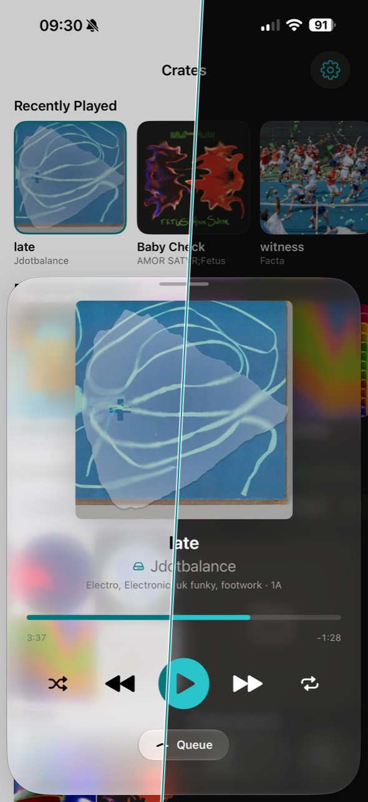
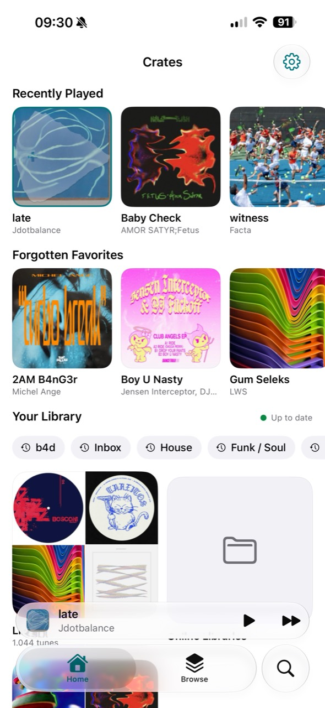
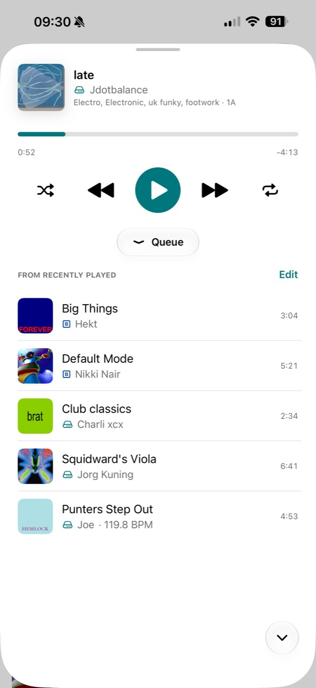
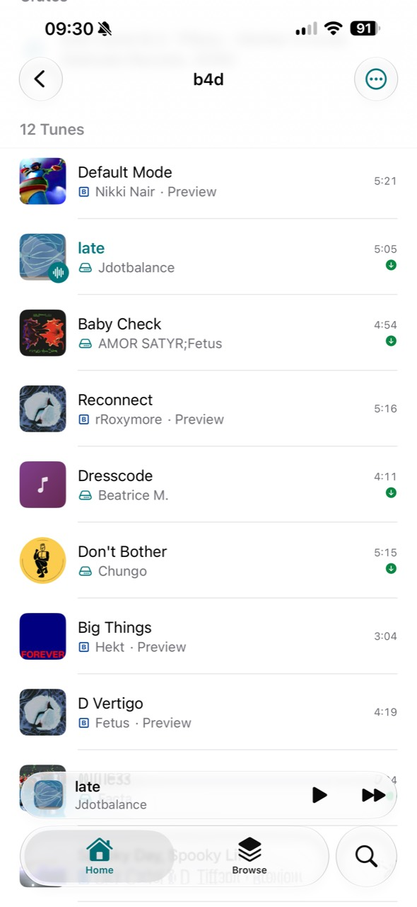

# Crates iOS

An unofficial native iPhone app for listening to a [Crates](https://crates.app) library. A small personal experiment with a narrower goal than the official app. Nearly all code in this project was created with the assistance of Claude Fable 5 and GPT-5.6 Sol. Please keep in mind this is just an **unofficial** and **personal** hobby project and in no way officially affiliated with the crates app or team.

<p align="center">
  
</p>

<table>
  <tr>
    <td width="33.33%"></td>
    <td width="33.33%"></td>
    <td width="33.33%"></td>
  </tr>
</table>

## Important limitations

- There is no App Store build, TestFlight, binary release, or other download. Installation currently requires compiling the app yourself.
- The app is for currently read-only. Creating or editing crates, playlists, tunes, and other library data is not supported at the moment.
- It has for now only been tested against Crates `1.15.3-beta.1` Other versions may not work correctly.
- This is a hobby project built around my own personal setup. Expect rough edges and incomplete behavior.

## Features

- Built in SwiftUI with smooth animations, background audio, and system media controls on the Lock Screen and in Control Center.
- Connect over the same network or through Tailscale. Tailscale creates a private connection between your devices, letting the phone reach a Crates server at home without exposing that server to the public internet.
- Side swipes on track rows expose Play Next and Add to Queue actions, with an editable queue in the expanded player.
- Light and dark mode themes available.
- Tunes with a Bandcamp source but no local audio source can play the available 128 kbps Bandcamp preview.
- Tunes with a local file source can be downloaded individually or as part of a crate or playlist. You are also able to only keep the last N amount of tunes added to a crate/playlist downloaded.
- Shuffle, repeat all, and repeat one are supported.
- Browsing and search remain available from the local cache when the server cannot be reached. The app always hits the cache first, so navigating around always feels responsive.

## Build from source

You will need macOS, Xcode with the iOS 26 SDK, [XcodeGen](https://github.com/yonaskolb/XcodeGen), and your own Apple development signing setup for a physical device.

```sh
git clone https://github.com/ellienieuwdorp/crates-ios.git
cd crates-ios
brew install xcodegen
xcodegen generate
open CratesIOS.xcodeproj
```

In Xcode, select your development team, choose an iPhone running iOS 26 or newer, and run the `CratesIOS` scheme. The app will guide you through pairing with a reachable Crates server.

## Contributions

Contributions are welcome, including small fixes, documentation, testing, and new experiments. Please keep the early-stage and personal nature of the project in mind.
